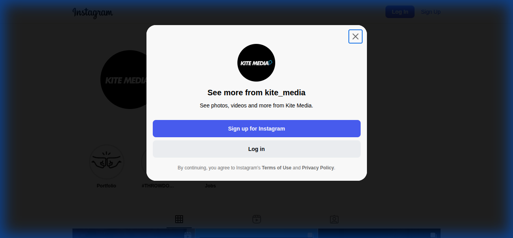
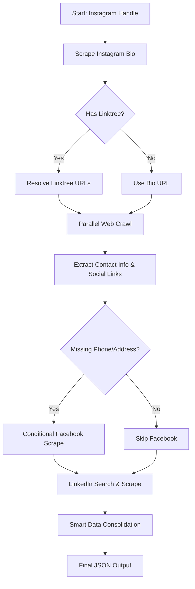
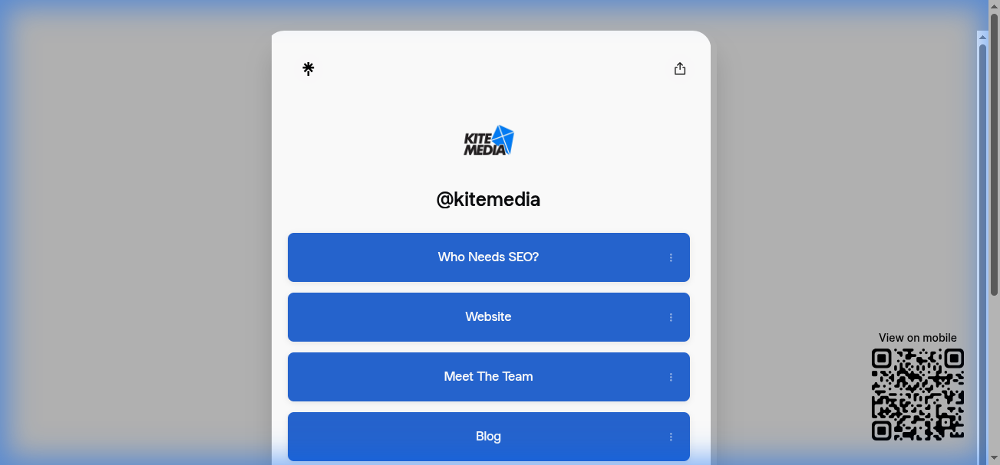
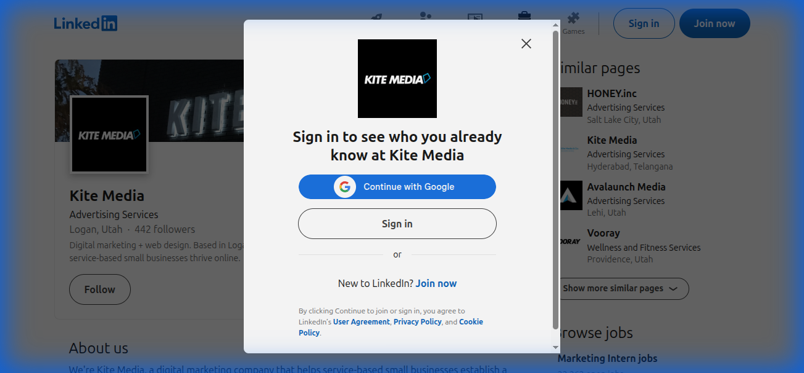

# Instagram Business Profile Scraper (V2)

A robust, multi-source scraping tool designed to extract comprehensive business intelligence starting from a single Instagram handle.



## 🚀 Features

- **Multi-Source Enrichment**: Automatically navigates from **Instagram** -> **Linktree** -> **Company Website** -> **Facebook** -> **LinkedIn** to build a complete profile.
- **Parallel Crawling**: V2 engine uses threaded enrichment to crawl multiple website links simultaneously, significantly reducing execution time.
- **Smart Data Extraction**:
  - **Role Prioritization**: Intelligently selects key personnel (Owner, Founder, CEO) from LinkedIn employee lists.
  - **Strict Email Matching**: Validates emails against the company domain to ensure accuracy, falling back to bio emails only when necessary.
  - **Location-Aware Search**: Uses Instagram bio location to disambiguate common company names on LinkedIn.
- **Resilience & Fallbacks**:
  - Handles rate limits and login requirements.
  - Conditional Facebook scraping (only attempts login if contact info is missing).
  - Robust error handling and logging.

## 💻 Technologies & APIs Used

This project leverages a hybrid scraping approach, combining official APIs with robust headless browsing to ensure maximum data yield and reliability.

- **[Instaloader](https://instaloader.github.io/)**: Used for interacting with Instagram's internal API to retrieve profile metadata, bio information, and follower counts without requiring a full browser session.
- **[Selenium](https://www.selenium.dev/)**: Powers the headless browser automation for scraping dynamic content from LinkedIn and Facebook, handling JavaScript rendering and login flows.
- **[Google Custom Search JSON API](https://developers.google.com/custom-search/v1/overview)**: Utilized as a high-precision fallback mechanism to discover LinkedIn company pages when they are not directly linked in the Instagram bio.
- **[BeautifulSoup4](https://www.crummy.com/software/BeautifulSoup/)**: Employed for efficient parsing of HTML content from static pages and rendered DOMs to extract text, links, and specific data points.
- **[Requests](https://requests.readthedocs.io/)**: Handles lightweight HTTP requests for API calls and static page retrieval where full browser automation is unnecessary.
- **Parallel Execution**: The `concurrent.futures` module is used to multithread the website enrichment process, allowing multiple external links to be crawled simultaneously.

## 🛠️ Installation

1. **Clone the repository**:

    ```bash
    git clone <repository-url>
    cd instagram_scraper
    ```

2. **Set up a virtual environment**:

    ```bash
    python -m venv .venv
    source .venv/bin/activate  # On Windows: .venv\Scripts\activate
    ```

3. **Install dependencies**:

    ```bash
    pip install -r requirements.txt
    ```

4. **Install Playwright browsers** (if required by specific modules, though Selenium is primary):

    ```bash
    playwright install
    ```

## 📖 Usage

Run the V2 scraper with a target Instagram handle:

```bash
python main_scraper_v2.py <instagram_handle>
```

**Example:**

```bash
python main_scraper_v2.py kite_media
```

### Output

The tool generates a flat JSON file (e.g., `kite_media_profile_v2.json`) containing the consolidated business profile:

```json
{
  "first_name": "Garrett",
  "last_name": "Kite",
  "email": "info@kitemedia.com",
  "role": "Owner @ Kite Media",
  "company": "Kite Media",
  "website": "https://linktr.ee/kitemedia",
  "metadata": {
    "username": "kite_media",
    "full_name": "Kite Media",
    "bio": "...",
    "enriched_data": { ... },
    "linkedin_data": { ... }
  }
}
```

## 🏗️ Architecture

The scraper follows a logical enrichment flow to gather and verify data:



## 📸 Visuals

### Linktree Resolution

The scraper automatically resolves Linktree URLs to find the actual business website.


### LinkedIn Enrichment

It finds the correct LinkedIn company page to extract employee details and company size.


## 🗺️ Roadmap

- [ ] **API Integration**: Expose the scraper as a REST API (Flask/FastAPI).
- [ ] **Proxy Rotation**: Implement smart proxy rotation to avoid rate limiting on high-volume scrapes.
- [ ] **Headless Improvements**: Further optimize headless browser performance for faster execution.
- [ ] **Database Sink**: Add option to save results directly to a PostgreSQL/MongoDB database.

## 📄 License

[MIT License](LICENSE)
